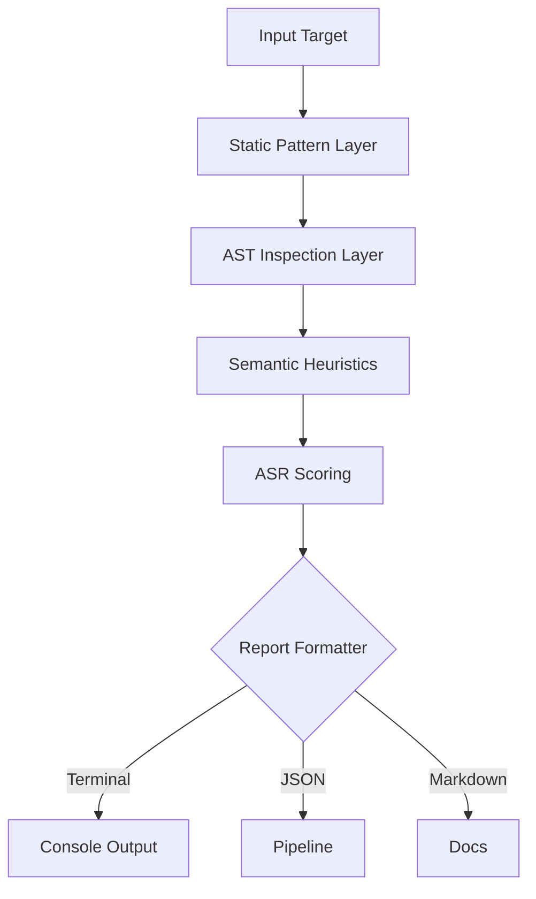
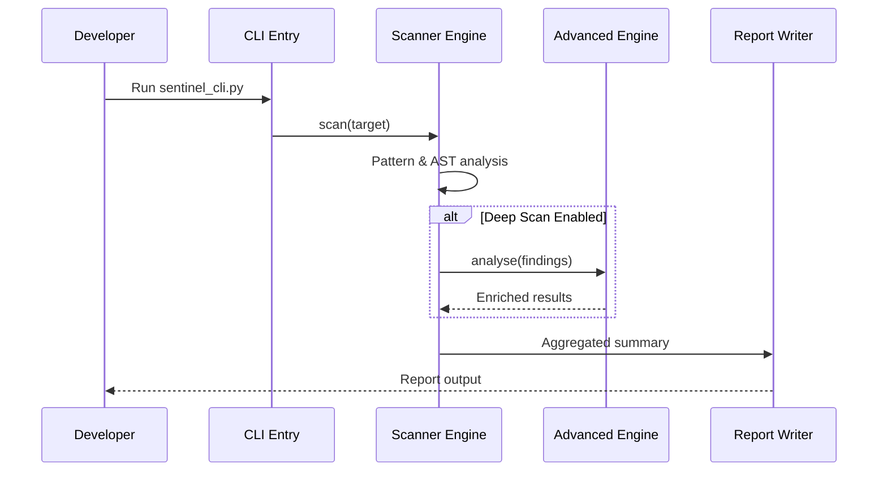
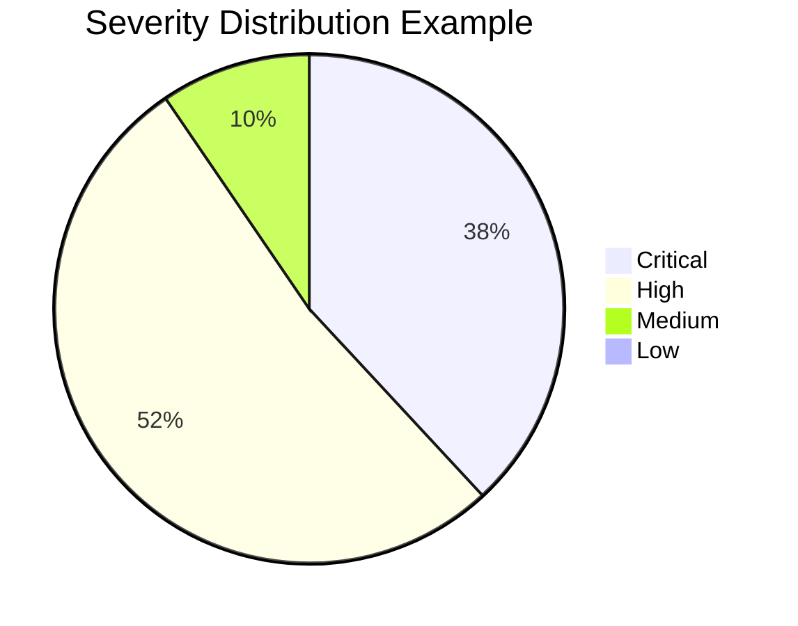

# Architecture Diagrams

```mermaid
graph TD
    A[Input Target] --> B[Static Pattern Layer]
    B --> C[AST Inspection Layer]
    C --> D[Semantic Heuristics]
    D --> E[ASR Scoring]
    E --> F{Report Formatter}
    F -->|Terminal| G1[Console Output]
    F -->|JSON| G2[Pipeline]
    F -->|Markdown| G3[Docs]
```

```mermaid
sequenceDiagram
    participant Dev as Developer
    participant CLI as CLI Entry
    participant Engine as Scanner Engine
    participant Adv as Advanced Engine
    participant Repo as Report Writer

    Dev->>CLI: Run sentinel_cli.py
    CLI->>Engine: scan(target)
    Engine->>Engine: Pattern & AST analysis

    alt Deep Scan Enabled
        Engine->>Adv: analyse(findings)
        Adv-->>Engine: Enriched results
    end

    Engine->>Repo: Aggregated summary
    Repo-->>Dev: Report output
```

```mermaid
pie title Severity Distribution Example
    "Critical" : 8
    "High" : 11
    "Medium" : 2
    "Low" : 0
```
