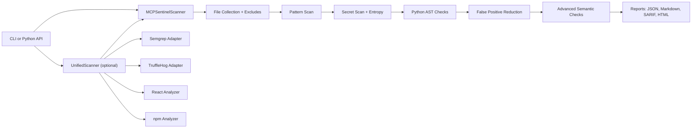

# MCP Sentinel Scanner Architecture Overview

This document is a blog-ready overview of how MCP Sentinel Scanner is structured, how data flows through the system, and where the extension points live. It is intended for readers who want a clear mental model before diving into code.

## Executive Summary

MCP Sentinel Scanner is a modular static analysis pipeline that combines:
1. A core scanner for fast, deterministic checks across multiple languages.
2. Optional external tool adapters for deeper coverage.
3. False-positive reduction layers tuned for test and documentation noise.
4. Multiple report formats for CI, dashboards, and human review.

## High-Level Data Flow

## Core Scanner

The core engine lives in `src/mcp_sentinel_scanner.py` and is responsible for:
1. Collecting files using extension filters and exclusion rules.
2. Running pattern-based detection for common vulnerability signatures.
3. Detecting hardcoded secrets using regex + entropy scoring.
4. Performing AST checks for dangerous Python calls like `eval` and `exec`.
5. Reducing false positives with context-aware heuristics.
6. Computing summary metrics like ASR and severity distribution.

## Advanced Semantic Checks

The advanced layer in `src/advanced_detection.py` enriches results with:
1. Auth bypass checks (constant `if True` conditions).
2. Crypto misuse detection (weak randomness and hash usage).
3. Cyclomatic complexity scoring for risk profiling.

Advanced detection is intended to be opt-in for deeper analysis runs. Use a dedicated CLI flag or config toggle to enable it when you want the extra signal.

## Unified Orchestration

The unified scanner (`src/unified_scanner.py`) runs multiple analyzers in parallel:
1. MCP Sentinel Scanner for baseline coverage.
2. Semgrep adapter for rule-based scanning (optional, requires Semgrep installed).
3. TruffleHog adapter for verified secret detection (optional, requires TruffleHog installed).
4. React analyzer for JSX and frontend risk patterns.
5. npm analyzer for dependency confusion, scripts, and `npm audit`.

Results are aggregated and fed through false-positive reduction before summaries and reports are generated. Optional tools are skipped when not enabled or not installed.

## False Positive Reduction

Noise reduction is handled by multiple focused components:
1. Context analyzer (`src/fp_reducer/context_analyzer.py`) filters test and example contexts.
2. Credential heuristics (`src/filters/false_positive_filter.py`) suppress placeholder or demo secrets.
3. Optional ML-style heuristics (`src/fp_reducer/ml_classifier.py`) for additional filtering.

These layers are designed to be conservative, avoiding suppression of high-confidence production risks.

## Reporting and Integration

The reporting layer supports:
1. JSON for integrations and programmatic pipelines.
2. SARIF for IDEs and GitHub Security.
3. HTML for executive and stakeholder reporting.
4. Markdown and terminal output for developer workflows.

CLI entrypoints are defined in `scripts/sentinel_cli.py` and exposed via `pyproject.toml`.

## Extension Points

The scanner was designed to be extended without invasive refactors:
1. Add new regex patterns in `_load_default_patterns`.
2. Add new adapters in `src/adapters/` and register them in `UnifiedScanner`.
3. Add analyzers for new ecosystems in `src/analyzers/`.
4. Add new reporters in `src/reporters/`.

## Repository Map

Key directories:
1. `src/` core scanner, adapters, analyzers, reporters, and FP reducers.
2. `scripts/` CLI entrypoints and automation utilities.
3. `tests/` unit and integration tests, plus regression fixtures.
4. `docs/` technical and product documentation.
5. `configs/` scan configuration files.
